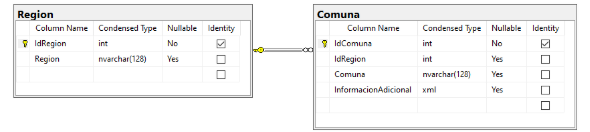
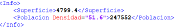

Dado el siguiente modelo de datos: 

Donde:

|Region||
| :- | :- |
|IdRegión|Autonumérico.|
|Región|Nombre de la región|

|Comuna||
| :- | :- |
|IdComuna|Autonumérico|
|Comuna|Nombre de la comuna|
|InformacionAdicional|
Almacena datos adicionales de la comuna: Superficie, Población y Densidad. El formato sugerido es:

|

Se solicita crear una solución en Visual Studio .NET con al menos 3 proyectos:

1. Un proyecto (dll) que maneje el acceso a datos.
1. Un proyecto (web) servicio api rest que exponga métodos para consultar y actualizar la información ocupando el proyecto de acceso a datos. 

   Ej:

|Verbo|Ejemplo|Comentario|
| :- | :- | :- |
|GET|http://......../.../../region|Listado de regiones|
|GET|http://......../.../../region/IdRegion|Información de 1 Región|
|GET|http://......../.../.. /region/IdRegion/comuna|Listado de Comunas de la región especificada|
|GET|http://......../.../.. /region/IdRegion/comuna/IdComuna|Información de 1 Comuna|
|POST|http://......../.../../region/IdRegion/comuna|Actualiza la información de la comuna dada|

1. Un proyecto (web) MVC que permita visualizar el listado de regiones existentes en la BBDD. Al seleccionar una región, ver el listado de comunas de dicha región y poder modificar la información de alguna de ellas. Este proyecto debe ocupar los métodos expuestos por el servicio web.

Las condiciones y elementos a considerar son los siguientes:

- El motor de BBDD debe ser SQL Server 2012 o superior.
- La integración con la BBDD debe ser 100% en base a procedimientos almacenados.
- La actualización de datos se debe realizar mediante la instrucción MERGE.
- El servicio web debe recibir y entregar datos en formato json.
- Creatividad y demostración de conocimientos en el desarrollo. La parte visual es lo menos importante (podría ocupar alguna plantilla de Bootstrap, eso no tiene tanta relevancia), lo realmente importante será la manera de pensar y de estructurar la solución.
- Algunos aspectos a considerar como bonus: Seguridad, Control de Excepciones, Registro de Log, Validaciones, Configuración, etc.

La realidad de los datos que se inserten en la BBDD no tiene importancia. Como referencia se puede ocupar la siguiente url: <https://es.wikipedia.org/wiki/Anexo:Comunas_de_Chile>